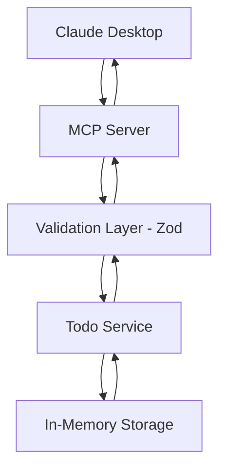

# 📋 MCP Todo List Server - Tutorial Completo

<div align="center">


</div>

## 🎯 O que é este projeto?

Este é um **servidor MCP (Model Context Protocol)** completo que implementa um sistema de gerenciamento de tarefas (Todo List) com validação robusta usando **TypeScript** e **Zod**. O servidor se integra diretamente com o **Claude Desktop**, permitindo que você gerencie suas tarefas através de conversas naturais com o Claude.

### 🌟 Por que usar MCP?

O **Model Context Protocol** é um protocolo desenvolvido pela Anthropic que permite aos assistentes de IA se conectarem com ferramentas e recursos externos de forma padronizada. Com este projeto, você pode:

- 🤖 **Conversar naturalmente** com Claude sobre suas tarefas
- 🔧 **Executar operações** diretamente através do chat
- 📊 **Obter insights** inteligentes sobre sua produtividade
- 🛡️ **Garantir validação** robusta de todos os dados

## ✨ Funcionalidades

### 🛠️ **CRUD Completo**
- ✅ **Criar** tarefas com título, descrição, prioridade e tags
- 📖 **Listar** tarefas com filtros avançados e paginação
- ✏️ **Atualizar** tarefas (marcar como concluída, alterar prioridade, etc.)
- 🗑️ **Deletar** tarefas específicas
- 🔍 **Buscar** tarefas por texto

### 📊 **Recursos Inteligentes**
- 📈 **Estatísticas** em tempo real (total, concluídas, pendentes)
- 📋 **Resumos** personalizados das tarefas
- 🎯 **Ajuda de priorização** baseada em IA
- 💡 **Insights de produtividade** com análises detalhadas

### 🔒 **Validação Robusta**
- ✅ **Zod schemas** para validação em runtime
- 🛡️ **Type safety** completa (compile-time + runtime)
- 🚨 **Mensagens de erro** claras e específicas
- 🧹 **Sanitização** automática de dados

### 🏷️ **Organização Avançada**
- 🎯 **Prioridades** (baixa, média, alta)
- 🏷️ **Tags** personalizadas para categorização
- 📅 **Timestamps** automáticos (criação, conclusão)
- 🔄 **Estados** (pendente, concluída)

## 🏗️ Arquitetura do Projeto

```
src/
├── schemas/                    # 📋 Validações Zod
│   ├── common.schemas.ts      # Schemas base (UUID, Date, etc.)
│   └── todo.schemas.ts        # Schemas específicos de tarefas
├── services/                   # 🔧 Lógica de negócio
│   └── todo.services.ts       # Gerenciamento das tarefas
├── utils/                      # 🛠️ Utilitários
│   └── validation.ts          # Helpers de validação
├── types.ts                    # 📝 Tipos TypeScript
├── server.ts                   # 🖥️ Servidor MCP principal
└── index.ts                    # 🚀 Ponto de entrada
```

### 🔄 **Fluxo de Dados**



## 📋 Pré-requisitos

- **Node.js** 18+ instalado
- **Claude Desktop** (versão mais recente)
- **npm** ou **yarn**
- Editor de código (**VS Code** recomendado)

## 🚀 Instalação Passo a Passo

### **Passo 1: Clonar/Baixar o Projeto**

```bash
# Se usando Git
git clone <seu-repositorio>
cd todo-list-mcp-server

# Ou criar nova pasta
mkdir todo-list-mcp-server
cd todo-list-mcp-server
```

### **Passo 2: Instalar Dependências**

```bash
# Instalar todas as dependências
npm install

# Verificar se instalou corretamente
npm list --depth=0
```

**Dependências principais:**
- `@modelcontextprotocol/sdk` - SDK oficial do MCP
- `zod` - Validação de schemas
- `typescript` - Linguagem TypeScript
- `tsx` - Executor TypeScript para desenvolvimento

### **Passo 3: Compilar o Projeto**

```bash
# Compilar TypeScript para JavaScript
npm run build

# Verificar se compilou corretamente
ls dist/
```

### **Passo 4: Testar o Servidor**

```bash
# Testar se o servidor inicia corretamente
npm start
```

**Você deve ver:**
```
🔧 Inicializando MCP Todo Server com Zod...
🚀 MCP Todo Server com Zod iniciado
✅ Validação robusta ativada
🔒 Type safety garantida
```

Pressione `Ctrl+C` para parar.

## ⚙️ Configuração do Claude Desktop

### **Passo 1: Localizar Arquivo de Configuração**

**Windows:**
```
%APPDATA%\Claude\claude_desktop_config.json
```

**macOS:**
```
~/Library/Application Support/Claude/claude_desktop_config.json
```

**Linux:**
```
~/.config/Claude/claude_desktop_config.json
```

### **Passo 2: Criar/Editar Configuração**

**⚠️ IMPORTANTE:** Use o **caminho absoluto** do seu projeto!

```bash
# Descobrir o caminho absoluto
# Windows:
echo %cd%

# macOS/Linux:
pwd
```

**Exemplo de configuração:**
```json
{
  "mcpServers": {
    "todo-server": {
      "command": "node",
      "args": ["C:/Users/SeuUsuario/caminho/para/todo-list-mcp-server/dist/index.js"]
    }
  }
}
```

### **Passo 3: Reiniciar Claude Desktop**

1. **Feche completamente** o Claude Desktop
2. **Aguarde 5 segundos**
3. **Abra novamente**

## 🎮 Como Usar

### **1. Comandos Básicos**

```bash
# Listar todas as tarefas
"Liste todas as minhas tarefas"

# Criar nova tarefa
"Crie uma tarefa: 'Estudar TypeScript' com prioridade alta"

# Buscar tarefas
"Procure por tarefas que contenham 'estudo'"

# Marcar como concluída
"Marque a tarefa com ID [uuid] como concluída"
```

### **2. Comandos Avançados**

```bash
# Criar tarefa completa
"Crie uma tarefa: 'Implementar autenticação' com descrição 'Adicionar login OAuth', prioridade alta e tags 'backend', 'segurança'"

# Filtrar por status
"Mostre apenas as tarefas pendentes"

# Filtrar por prioridade
"Liste todas as tarefas de prioridade alta"

# Obter estatísticas
"Mostre as estatísticas das minhas tarefas"
```

### **3. Recursos Inteligentes**

```bash
# Resumo personalizado
"Gere um resumo das minhas tarefas agrupadas por prioridade"

# Ajuda de priorização
"Me ajude a priorizar minhas tarefas pendentes"

# Insights de produtividade
"Analise minha produtividade e dê sugestões"
```

## 🔧 Estrutura dos Dados

### **Modelo de Tarefa**

```typescript
interface Todo {
  id: string;           // UUID único
  title: string;        // Título (1-200 caracteres)
  description?: string; // Descrição opcional (max 500 chars)
  completed: boolean;   // Status de conclusão
  createdAt: Date;      // Data de criação
  completedAt?: Date;   // Data de conclusão (se aplicável)
  priority: 'low' | 'medium' | 'high'; // Prioridade
  tags: string[];       // Tags para organização (max 10)
}
```

### **Exemplo de Tarefa**

```json
{
  "id": "550e8400-e29b-41d4-a716-446655440000",
  "title": "Estudar MCP Protocol",
  "description": "Aprender sobre Model Context Protocol com TypeScript e Zod",
  "completed": false,
  "createdAt": "2024-01-15T10:30:00.000Z",
  "priority": "high",
  "tags": ["estudo", "typescript", "mcp"]
}
```

## 🛠️ Recursos do MCP Implementados

### **1. Resources (Recursos)**
Endpoints read-only para visualizar dados:

| URI | Descrição |
|-----|-----------|
| `todo://all` | Lista completa de tarefas |
| `todo://stats` | Estatísticas das tarefas |
| `todo://completed` | Apenas tarefas concluídas |
| `todo://pending` | Apenas tarefas pendentes |

### **2. Tools (Ferramentas)**
Operações que modificam dados:

| Ferramenta | Descrição |
|------------|-----------|
| `create_todo` | Criar nova tarefa |
| `update_todo` | Atualizar tarefa existente |
| `delete_todo` | Deletar tarefa |
| `list_todos` | Listar com filtros e paginação |
| `get_todo` | Buscar tarefa por ID |
| `search_todos` | Busca textual |

### **3. Prompts (Templates)**
Templates contextuais para análise:

| Prompt | Descrição |
|--------|-----------|
| `todo_summary` | Resumo personalizado |
| `todo_prioritization` | Ajuda de priorização |
| `productivity_insights` | Análise de produtividade |

## 🔍 Validação com Zod

### **Por que Zod?**

O **Zod** garante que todos os dados sejam válidos tanto em **compile-time** quanto em **runtime**:

```typescript
// ❌ SEM Zod - Perigoso
function createTodo(data: any) {
  return {
    title: data.title, // Pode ser undefined, null, ou vazio!
    priority: data.priority, // Pode ser qualquer string!
  };
}

// ✅ COM Zod - Seguro
function createTodo(data: unknown) {
  const validatedData = validateData(CreateTodoSchema, data);
  return {
    title: validatedData.title, // ✅ String válida (1-200 chars)
    priority: validatedData.priority, // ✅ 'low' | 'medium' | 'high'
  };
}
```

### **Schemas Implementados**

```typescript
// Schema base de tarefa
export const TodoSchema = z.object({
  id: UuidSchema,
  title: NonEmptyStringSchema.max(200),
  description: z.string().max(500).optional(),
  completed: z.boolean().default(false),
  createdAt: DateSchema,
  completedAt: DateSchema.optional(),
  priority: z.enum(['low', 'medium', 'high']).default('medium'),
  tags: z.array(z.string().min(1).max(50)).max(10).default([])
});

// Schema para criar tarefa
export const CreateTodoSchema = z.object({
  title: NonEmptyStringSchema.max(200),
  description: z.string().max(500).optional(),
  priority: z.enum(['low', 'medium', 'high']).default('medium'),
  tags: z.array(z.string().min(1).max(50)).max(10).default([])
});
```

## 📊 Exemplos de Uso Completos

### **Cenário 1: Gerenciamento de Projeto**

```bash
Usuário: "Crie as seguintes tarefas para meu projeto:
1. 'Setup inicial do projeto' - prioridade alta
2. 'Implementar autenticação' - prioridade média  
3. 'Escrever testes' - prioridade baixa"

Claude: [Cria as 3 tarefas usando a ferramenta create_todo]

Usuário: "Me ajude a priorizar essas tarefas"

Claude: [Usa o prompt todo_prioritization para análise]

Usuário: "Marque a primeira tarefa como concluída"

Claude: [Usa update_todo para marcar como completed: true]
```

### **Cenário 2: Análise de Produtividade**

```bash
Usuário: "Gere um relatório da minha produtividade"

Claude: [Usa productivity_insights para análise completa]
- Taxa de conclusão: 75%
- Tarefas de alta prioridade: 80% concluídas
- Tags mais utilizadas: frontend (60%), backend (40%)
- Sugestões de melhoria...

Usuário: "Mostre apenas tarefas pendentes de alta prioridade"

Claude: [Usa list_todos com filtros status=pending, priority=high]
```

## 🔧 Desenvolvimento e Personalização

### **Estrutura para Extensão**

```typescript
// Adicionar novo campo no schema
export const TodoSchema = z.object({
  // ... campos existentes
  deadline?: z.date().optional(),        // Nova: Data limite
  project?: z.string().optional(),       // Nova: Projeto
  assignee?: z.string().optional(),      // Nova: Responsável
});

// Criar nova ferramenta
{
  name: "set_deadline",
  description: "Definir prazo para tarefa",
  inputSchema: {
    type: "object",
    properties: {
      id: { type: "string", format: "uuid" },
      deadline: { type: "string", format: "date" }
    },
    required: ["id", "deadline"]
  }
}
```

### **Comandos de Desenvolvimento**

```bash
# Desenvolvimento com hot-reload
npm run dev

# Compilar apenas
npm run build

# Validar TypeScript sem compilar
npm run validate

# Testar servidor
npm start
```

## 🐛 Troubleshooting

### **Problema 1: "Server disconnected"**

**Causa:** Erro no código TypeScript ou dependências faltando.

**Solução:**
```bash
# 1. Verificar se compila
npm run build

# 2. Testar manualmente
npm start

# 3. Verificar logs
# Windows: %APPDATA%\Claude\logs\
# macOS: ~/Library/Logs/Claude/
```

### **Problema 2: "Cannot find module"**

**Causa:** Caminho incorreto na configuração do Claude Desktop.

**Solução:**
```bash
# 1. Verificar caminho absoluto
pwd  # macOS/Linux
echo %cd%  # Windows

# 2. Usar caminho completo na configuração
{
  "mcpServers": {
    "todo-server": {
      "command": "node",
      "args": ["/caminho/absoluto/completo/dist/index.js"]
    }
  }
}
```

### **Problema 3: Claude não reconhece ferramentas**

**Causa:** Servidor não carregou ou configuração inválida.

**Solução:**
```bash
# 1. Verificar sintaxe JSON
# Use um validador JSON online

# 2. Reiniciar Claude Desktop completamente
# Fechar > Aguardar > Abrir

# 3. Testar comando específico
"Use a ferramenta list_todos"
```

### **Problema 4: Erro de validação Zod**

**Causa:** Dados inválidos sendo enviados.

**Solução:**
```typescript
// Verificar schema correspondente
console.log(CreateTodoSchema.parse(data));

// Adicionar logs para debug
console.error('Dados recebidos:', JSON.stringify(data, null, 2));
```

## 📚 Conceitos Aprendidos

### **1. MCP Protocol**
- **Resources:** Dados read-only acessíveis via URIs
- **Tools:** Operações que modificam estado
- **Prompts:** Templates para interação contextual
- **Comunicação:** JSON-RPC via stdio transport

### **2. TypeScript + Zod**
- **Type Safety:** Detecção de erros em compile-time
- **Runtime Validation:** Verificação em tempo de execução
- **Schema-First:** Definir estrutura antes da implementação
- **Type Inference:** Tipos automáticos a partir de schemas

### **3. Arquitetura Modular**
- **Separation of Concerns:** Cada arquivo tem responsabilidade específica
- **Dependency Injection:** Serviços independentes e testáveis
- **Error Handling:** Tratamento consistente de erros
- **Validation Layer:** Camada de validação centralizada

## 🚀 Próximos Passos

### **1. Funcionalidades Avançadas**
- 💾 **Persistência:** Adicionar SQLite ou PostgreSQL
- 👥 **Multi-usuário:** Sistema de autenticação
- 📅 **Calendário:** Integração com datas e prazos
- 🔔 **Notificações:** Lembretes automáticos

### **2. Integração**
- 📧 **Email:** Criar tarefas via email
- 📱 **Mobile:** API REST para aplicativo móvel
- 🌐 **Web:** Interface web administrativa
- 📊 **Analytics:** Dashboards de produtividade

### **3. Qualidade**
- 🧪 **Testes:** Unitários e de integração
- 📖 **Documentação:** API docs automática
- 🚀 **Deploy:** Docker e cloud deployment
- 📈 **Monitoring:** Logs e métricas

## 📄 Licença

MIT License - veja o arquivo [LICENSE](LICENSE) para detalhes.

## 🤝 Contribuição

1. Fork o projeto
2. Crie uma branch para sua feature (`git checkout -b feature/AmazingFeature`)
3. Commit suas mudanças (`git commit -m 'Add some AmazingFeature'`)
4. Push para a branch (`git push origin feature/AmazingFeature`)
5. Abra um Pull Request

## 📞 Suporte

- 🐛 **Issues:** [GitHub Issues](https://github.com/seu-usuario/todo-list-mcp-server/issues)
- 📖 **Documentação MCP:** [modelcontextprotocol.io](https://modelcontextprotocol.io)
- 💬 **Discussões:** [GitHub Discussions](https://github.com/seu-usuario/todo-list-mcp-server/discussions)

---

**Desenvolvido com ❤️ usando TypeScript, Zod e MCP Protocol**

*Este projeto demonstra como criar servidores MCP robustos e type-safe para integração com assistentes de IA.*